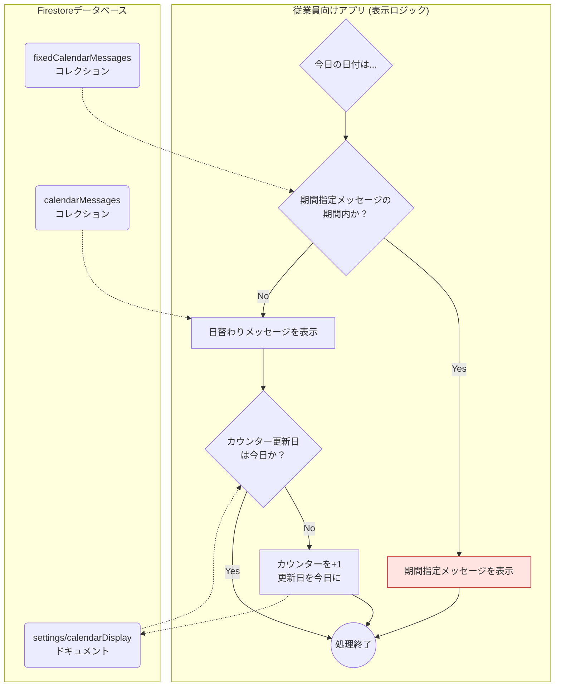

# カレンダー機能 データベース設計・仕様書

## 1. 概要

このドキュメントは、管理者画面で設定された「日替わりメッセージ」と「期間指定メッセージ」を、従業員向けアプリのカレンダーにどのように表示するかの技術仕様とデータベース設計を定義します。

本機能の核心は、**「期間指定メッセージ」を「日替わりメッセージ」よりも優先して表示する**ロジックと、複数ユーザー環境でも正確に日替わりを実現する**カウンター更新制御**にあります。

---

## 2. データベース設計 (Firestore)

この機能は、役割の異なる以下の3つのコレクション/ドキュメントを利用して実現されます。

### 2.1. `calendarMessages` コレクション (日替わり用)

通常時に毎日順番に表示されるメッセージ群を格納します。

-   **コレクションパス**: `calendarMessages`
-   **ドキュメントの主なフィールド**:
    -   `title` (string): メッセージのタイトル
    -   `content` (string): メッセージの本文（HTML形式）
    -   `icon` (string): アイコン名
    -   `order` (number): 表示順を決定する数値（昇順）

### 2.2. `fixedCalendarMessages` コレクション (期間指定用)

特定の期間に優先して表示したい、単発または短期のメッセージを格納します。

-   **コレクションパス**: `fixedCalendarMessages`
-   **ドキュメントの主なフィールド**:
    -   `title` (string): メッセージのタイトル
    -   `content` (string): メッセージの本文（HTML形式）
    -   `icon` (string): アイコン名
    -   `startDate` (Timestamp): このメッセージの**表示開始日**
    -   `endDate` (Timestamp): このメッセージの**表示終了日**

### 2.3. `settings/calendarDisplay` ドキュメント

日替わりメッセージの表示サイクルを管理するための「司令塔」です。

-   **コレクションパス**: `settings`
-   **ドキュメントID**: `calendarDisplay`
-   **フィールド**:
    -   `dailyLoopCounter` (number): `calendarMessages`の`order`と対応し、次に表示すべきメッセージの番号を記録しています。
    -   `lastUpdatedDate` (Timestamp): **カウンターが最後に更新された日付**を記録します。これにより、カウンターの更新が1日に1回だけ行われることを保証します。

---

## 3. アプリケーション側の表示ロジック

従業員向けアプリがカレンダーページを開いた際、以下のステップで表示内容とカウンター更新を決定します。

1.  **【最優先】期間指定メッセージの検索**:
    -   まず、`fixedCalendarMessages`コレクションを検索し、**今日の日付が`startDate`と`endDate`の範囲内に含まれる**ドキュメントがあるかを確認します。
    -   該当するドキュメントが**見つかった場合**、そのメッセージを表示し、以降の処理はすべて中断します。日替わりカウンターの更新も行われません。
    -   もし複数のメッセージが該当期間にある場合は、`startDate`が最も新しいものが優先されます。

2.  **【通常】日替わりメッセージの表示**:
    -   上記1.で該当するメッセージが**見つからなかった場合**にのみ、こちらのロジックが実行されます。
    -   `settings/calendarDisplay`ドキュメントから現在の`dailyLoopCounter`の値を取得します。
    -   `calendarMessages`コレクション全体を`order`順で取得し、`dailyLoopCounter`の値に対応する順序のメッセージを「今日表示するメッセージ」として決定します。

3.  **【カウンター更新】日付比較とカウンター更新処理**:
    -   メッセージを表示する直前に、`settings/calendarDisplay`の`lastUpdatedDate`と**今日の日付**を比較します。
    -   **日付が変わっていた場合**（`lastUpdatedDate`が昨日以前の場合）、そのユーザーが今日の最初の訪問者であるため、以下の更新処理を**トランザクションで**実行します。
        1.  `dailyLoopCounter`を1つ進める（リストの最後に達したら0に戻る）。
        2.  `lastUpdatedDate`を今日の日付に更新する。
    -   **日付が変わっていなかった場合**は、既に他の誰かがカウンターを更新済みなので、書き込みは行わず、読み取った`dailyLoopCounter`の値を使ってメッセージを表示するだけです。

4.  **表示コンテンツがない場合**:
    -   どのコレクションにも表示すべきメッセージが1件も登録されていない場合は、エラーとせず、カレンダーエリアには何も表示しません。

この設計により、複数ユーザーが何回アクセスしても日替わり表示がズレることなく、かつ管理者は任意のタイミングで特別なメッセージに割り込ませることが可能になります。
