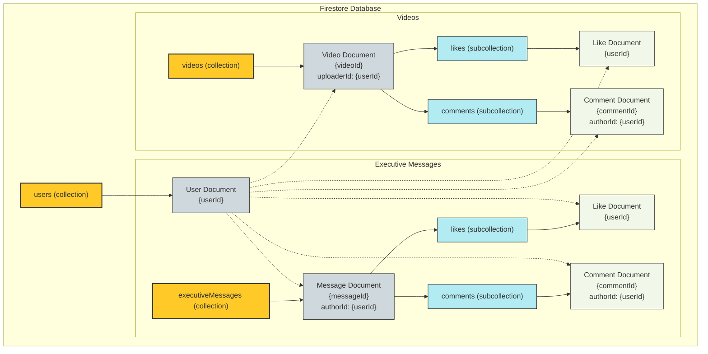

# Firestore コレクション構造図

このドキュメントは、`executiveMessages` および `videos` コレクションと、それに関連するサブコレクションの構造を視覚的に示します。

### 図の説明

*   **黄色の箱**: トップレベルのコレクション (`users`, `executiveMessages`, `videos`) を表します。
*   **グレーの箱**: 個々のドキュメントを表します。`{messageId}` や `{userId}` は、実際のドキュメントIDが入る場所を示します。
*   **水色の箱**: サブコレクション (`likes`, `comments`) を表します。
*   **薄緑の箱**: サブコレクション内のドキュメントを表します。
*   **実線の矢印 (-->)**: 親から子への関係（コレクションがドキュメントを含む、ドキュメントがサブコレクションを含むなど）を示します。
*   **破線の矢印 (-.->)**: `authorId` や `userId` などのフィールドによる、ドキュメント間の参照関係を示します。

この図が、今後の開発における認識合わせの助けとなれば幸いです。
