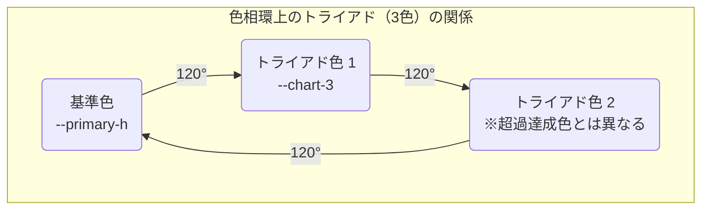

# 「グラフカラー」動的計算ロジック解説書

## 1. 概要

このドキュメントは、Philosアプリケーションのグラフ（`widget-preview.tsx`）で表示される各色（実績、超過達成、不足分、折れ線グラフなど）が、管理画面の「外観設定」で指定された**プライマリーカラー**を基準に、どのように動的に計算・生成されるかの技術的な仕組みについて解説します。

## 2. 基本的な考え方：HSL色空間とCSS変数の活用

この機能の核心は、**HSL色空間**と**CSS変数（カスタムプロパティ）**の組み合わせにあります。

*   **HSLとは？**: `Hue（色相）`, `Saturation（彩度）`, `Lightness（輝度）`の3つの要素で色を表現する方法です。
    *   **色相 (Hue)**: ご指摘の通り、`0〜360`度の角度で色（赤、黄、緑、青など）を指定する値です。`--primary-h`には、この角度の数値がそのまま格納されています。
    *   **彩度 (Saturation)**: 色の鮮やかさを`%`で指定します。
    *   **輝度 (Lightness)**: 色の明るさを`%`で指定します。

*   **なぜHSLなのか？**: HSLを使う最大のメリットは、「色の関係性」を数学的に計算しやすい点にあります。
    *   **反対色（補色）**: 色相を`180度`回転させるだけで簡単に作れます。
    *   **明るい/暗い色**: 輝度（Lightness）の値を変更するだけで簡単に作れます。
    *   **調和の取れた色**: 色相を一定の角度（例: 120度）回転させるだけで、バランスの取れた配色を簡単に作れます。

## 3. 実装のステップ

### ステップ1: プライマリーカラーをHSLの各要素に分解

*   **担当ファイル**: `src/context/BrandingProvider.tsx`
*   **処理内容**:
    1.  データベースから`primaryColor`（例: `"142.1 76.2% 36.3%"`）を取得します。
    2.  この文字列を空白で分割し、それぞれをCSSのグローバル変数に設定します。
        *   `--primary-h`: `142.1`
        *   `--primary-s`: `76.2%`
        *   `--primary-l`: `36.3%`

### ステップ2: 各グラフの色をCSSの`calc()`で計算

*   **担当ファイル**: `src/app/globals.css`
*   **処理内容**: 分解された`--primary-h`を基準に、CSSの`calc()`関数を使って各グラフ用の色を定義します。

#### a. 実績 (基本色)

*   **CSS変数**: `--chart-1`
*   **ロジック**: プライマリーカラーのHSL値をそのまま結合します。
    ```css
    --chart-1: var(--primary-h) var(--primary-s) var(--primary-l);
    ```

#### b. 超過達成 (反対色/補色)

*   **CSS変数**: `--chart-2`
*   **ロジック**: 色相を**180度**回転させます。これにより、色相環の正反対にある補色が生成され、視覚的に最も対照的な色になります。
    ```css
    --chart-2: calc(var(--primary-h) + 180) var(--primary-s) var(--primary-l);
    ```

#### c. 折れ線グラフ (トライアド色)

*   **CSS変数**: `--chart-3`
*   **ロジックの解説**: ご質問いただいた「なぜ90度ではなく120度なのか」という点ですが、これは**トライアド（3色配色）**という色彩理論の手法を採用しているためです。
    *   **トライアド配色とは？**: 色相環を正三角形のように3等分する位置にある3つの色（基準に対して`+120度`, `+240度`）を組み合わせる方法です。
    *   **なぜこの手法か？**: この組み合わせは、それぞれの色が持つ個性を保ちつつ、高いコントラストと視覚的なバランスを生み出します。グラフ上で「実績」「超過達成」「目標」といった異なるデータを明確に区別させたい場合に、非常に効果的です。90度回転（四角形配色）も有効な手法ですが、3色を扱う場合はトライアドの方がよりダイナミックで調和の取れた印象を与えやすいというメリットがあります。
*   **CSS**:
    ```css
    --chart-3: calc(var(--primary-h) + 120) var(--primary-s) var(--primary-l);
    ```

#### d. 目標・不足分 (薄い色)

*   **CSS変数**: `--chart-4`
*   **ロジック**: 色相と彩度はそのままに、**輝度(L)だけを高い値（例: `92%`）**に固定します。これにより、元の色の非常に明るい（淡い）バージョンが生成され、背景色のように使っても邪魔になりません。
    ```css
    --chart-4: var(--primary-h) var(--primary-s) 92%;
    ```

## 4. 色の関係性の可視化

プライマリーカラー（基準色）を頂点として、色相環上で正三角形を描く3つの色が「トライアド配色」です。これにより、どの色が選ばれても、常にバランスの取れた色の組み合わせが保証されます。


*補足: `--chart-2`（超過達成色）には、より強いコントラストを持たせるため、トライアドの3番目の色（`+240度`）ではなく、正反対にある補色（`+180度`）を意図的に採用しています。*


この仕組みにより、管理者がどんなプライマリーカラーを選んでも、常に数学的に調和の取れた色の組み合わせがグラフに自動で適用されます。
