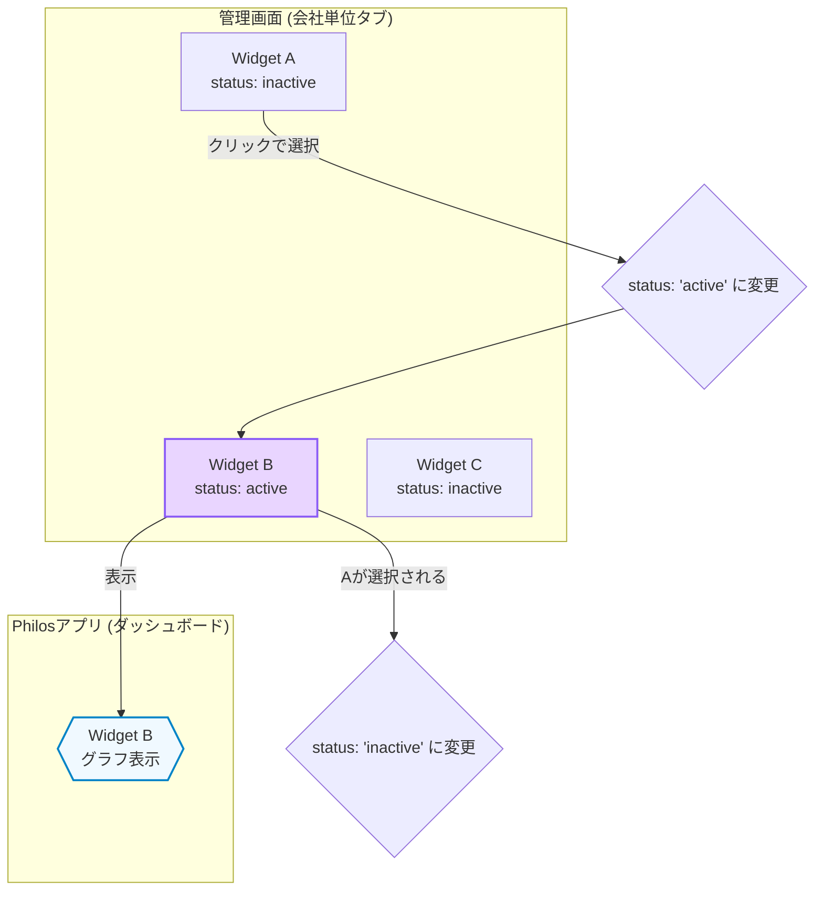

# ダッシュボードデータ管理仕様書

## 1. 概要

このドキュメントは、管理者向け画面の「ダッシュボード設定」機能における、データモデルと主要なロジックについて定義します。この機能により、管理者はPhilosの従業員向けアプリに表示されるダッシュボードのグラフ（ウィジェット）を柔軟に管理・変更できます。

---

## 2. データモデル

本機能は、主に「ウィジェット」と「売上実績」という2つのデータで構成されます。これらのデータは現在、管理者画面のコンポーネント内（`dashboard/page.tsx`）で状態として管理されていますが、将来的にはFirestoreなどのデータベースに保存することも可能です。

### 2.1. ウィジェット (`Widget`)

ダッシュボードに表示される各グラフの設定情報を保持します。

```typescript
type Widget = {
  id: string;          // ウィジェットの一意なID
  title: string;       // グラフのタイトル (例: "全社売上高の推移")
  scope: 'company' | 'team' | 'personal'; // 対象単位
  kpi: string;         // 表示する重要業績評価指標 (例: "sales_revenue")
  chartType: string;   // グラフの種類 (例: "composed", "bar", "pie")
  status: 'active' | 'inactive'; // ★ 表示状態を管理するフラグ
};
```

*   **`scope`**: ウィジェットが「会社単位」「チーム単位」「個人単位」のどのカテゴリに属するかを定義します。
*   **`kpi`**: どのデータをグラフに表示するかを決定します。例えば `sales_revenue` が指定されたウィジェットは、後述の「売上実績」データと連携します。
*   **`status`**: このウィジェットが現在Philosアプリに**表示されているか**どうかを示します。
    *   `active`: 表示中。各`scope`内で`active`にできるウィジェットは常に1つだけです。
    *   `inactive`: 非表示。

### 2.2. 売上実績 (`SalesRecord`)

`kpi`が`sales_revenue`のウィジェットに表示するための、月次の売上目標と実績データを保持します。

```typescript
type SalesRecord = {
  id: string;           // レコードの一意なID (例: "2024-08")
  year: number;         // 対象年 (例: 2024)
  month: number;        // 対象月 (例: 8)
  salesTarget: number;  // 売上目標（単位: 百万円）
  salesActual: number;  // 売上実績（単位: 百万円）
  achievementRate: number; // 達成率 (%)
};
```

---

## 3. 主要なロジック

### 3.1. ウィジェットの選択と表示ロジック

管理画面では、作成されたウィジェットがカテゴリ（`scope`）ごとに一覧表示されます。

*   管理者がリストの中から特定のウィジェットを「表示対象」として選択（星マークをクリック）すると、そのウィジェットの`status`が`active`に更新されます。
*   同時に、同じカテゴリ内の他のすべてのウィジェットの`status`は自動的に`inactive`に更新されます。
*   これにより、**各カテゴリ（会社・チーム・個人）において、常に1つのウィジェットだけが`active`である状態**が保証されます。
*   従業員向けアプリは、この`status: 'active'`のウィジェットを読み込んでダッシュボードに表示します。



### 3.2. 会計年度の取り扱い

売上実績グラフの表示期間は、日本の多くの企業で採用されている会計年度に合わせて調整されます。

*   **年度の定義**: **8月から翌年7月まで**を1つの会計年度とします。
    *   例: 「2024年度」は、2023年8月から2024年7月までの期間を指します。
*   **データ絞り込み**: 管理画面上部の年度セレクターで「2024」を選択すると、グラフには2023年8月〜2024年7月の`SalesRecord`データが抽出・表示されます。

この仕組みにより、管理者は暦年ではなく、実際の事業年度に基づいた業績の推移を直感的に把握できます。
