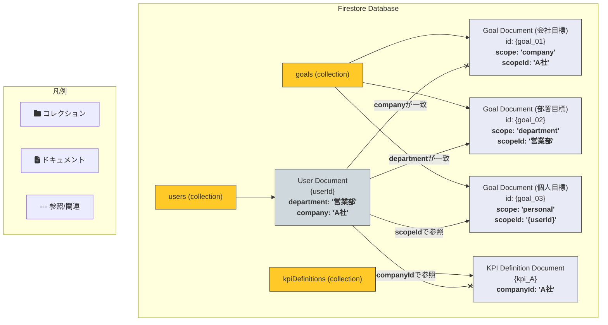

# 「目標設定」機能 DB設計図

このドキュメントは、提案された「目標設定」機能のFirestoreデータベース構造を視覚的に示したものです。
「会社」「組織」「個人」のすべての目標を単一の `goals` コレクションに集約し、各ドキュメントに持たせた `scope` と `scopeId` フィールドによって、それらを識別・関連付ける設計案です。

### 図の説明

*   **`users` (コレクション)**
    *   ユーザー情報を管理します。各ユーザーは、自分がどの「部署」や「会社」に所属しているかという情報を持っています。
*   **`kpiDefinitions` (コレクション)**
    *   会社ごとに設定できるKPIの選択肢を管理します。（例：「A社」では「契約数」と「顧客満足度」が選べる）
*   **`goals` (コレクション)**
    *   これが私たちの提案の核となる、**すべての目標をまとめた大きな箱**です。
    *   **会社目標**: `scope`が`'company'`、`scopeId`が会社名（例: `'A社'`）になります。
    *   **部署目標**: `scope`が`'department'`、`scopeId`が部署名（例: `'営業部'`）になります。
    *   **個人目標**: `scope`が`'personal'`、`scopeId`が個人のID（`'{userId}'`）になります。この`scopeId`が、`users`コレクションの各ユーザーに直接リンクします。

### 「部署メンバーの個人目標」を取得する流れ（図での見方）

1.  アプリで「営業部」が選択されると、まず`users`コレクションを見て、`department`が`'営業部'`のユーザーを探します (図の`User Document`が該当)。
2.  次に、`goals`コレクションに対し、「`scope`が`'personal'`で、かつ`scopeId`が1で見つかったユーザーのIDと一致するもの」を探します。
3.  これにより、`PersonalGoalDoc`が取得でき、画面に表示される、という流れになります。

この図によって、全体の構造がより明確になれば幸いです。