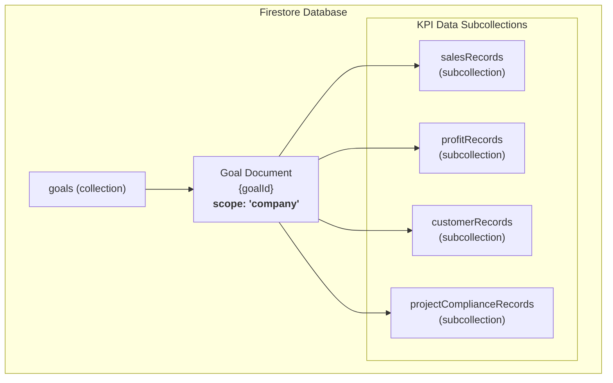

# 「会社単位の目標設定」機能仕様書

## 1. 概要

このドキュメントは、管理者向け画面の「目標設定」ページにおける**会社単位**の目標設定機能に関する、データモデル、主要ロジック、および画面仕様を定義します。

この機能により、経営層ユーザー（`role: 'executive'`）は、自身が所属する会社全体の目標（ウィジェット）をKPIごとに設定・管理し、従業員向けアプリのダッシュボードに表示するグラフをコントロールできます。

---

## 2. データベース設計 (Firestore)

本機能は、単一の `goals` コレクションと、各目標に紐づくサブコレクションによってデータを管理します。

### 2.1. コレクション階層図



### 2.2. `goals` コレクション

*   **コレクションパス**: `/goals`
*   **目的**: 表示されるウィジェットの設定情報を格納します。`scope: 'company'` のドキュメントが会社単位の目標に該当します。

#### データモデル (`Goal`)

```typescript
{
  id: string;          // ドキュメントID
  title: string;       // ウィジェットのタイトル (例: "2025年度 通期売上目標")
  scope: "company";    // 対象単位 (この仕様では 'company' に固定)
  scopeId: string;     // ユーザーの所属会社ID (user.company)
  kpi: string;         // 重要業績評価指標 (下記参照)
  chartType: string;   // グラフの種類 (bar, line, pie, composedなど)
  status: "active" | "inactive"; // 表示状態 ('active'はscopeIdごとに1つだけ)
  fiscalYear?: number; // 対象会計年度 (KPIによる)
  fiscalYearStartMonth?: number; // 会計年度の開始月 (KPIによる)
  authorId: string;    // 作成者のUID
  createdAt: Timestamp;
  updatedAt: Timestamp;
}
```

### 2.3. KPIデータ サブコレクション

各`goal`ドキュメントの下に、選択された`kpi`に応じた月次データを格納するサブコレクションが作成されます。ドキュメントIDは `${year}-${month}` 形式です。

#### a. 売上高 (`salesRecords`)

*   **KPI**: `sales_revenue`
*   **パス**: `/goals/{goalId}/salesRecords/{recordId}`
*   **データモデル (`SalesRecord`)**:
    ```typescript
    {
      year: number;
      month: number;
      salesTarget: number;  // 売上目標
      salesActual: number;  // 売上実績
      achievementRate: number; // 達成率
    }
    ```

#### b. 営業利益率 (`profitRecords`)

*   **KPI**: `profit_margin`
*   **パス**: `/goals/{goalId}/profitRecords/{recordId}`
*   **データモデル (`ProfitRecord`)**:
    ```typescript
    {
      year: number;
      month: number;
      operatingProfit: number; // 営業利益
      salesRevenue: number;    // 売上高
      profitMargin: number;    // 営業利益率
    }
    ```

#### c. 総顧客数 (`customerRecords`)

*   **KPI**: `new_customers` (ラベルは「総顧客数」)
*   **パス**: `/goals/{goalId}/customerRecords/{recordId}`
*   **データモデル (`CustomerRecord`)**:
    ```typescript
    {
      year: number;
      month: number;
      totalCustomers: number; // 総顧客数
    }
    ```

#### d. プロジェクト納期遵守率 (`projectComplianceRecords`)

*   **KPI**: `project_delivery_compliance`
*   **パス**: `/goals/{goalId}/projectComplianceRecords/{recordId}`
*   **データモデル (`ProjectComplianceRecord`)**:
    ```typescript
    {
      year: number;
      month: number;
      counts: {
        compliant: number;   // 遵守
        minor_delay: number; // 軽微な遅延
        delayed: number;     // 遅延
      };
    }
    ```

---

## 3. 機能仕様・ロジック

### 3.1. 権限管理

*   会社単位の目標（ウィジェット）の**作成・編集・削除・表示設定**は、`role`が`executive`のユーザーのみ可能です。
*   `admin`ユーザーおよびその他のユーザーは、目標の閲覧のみ可能です。

### 3.2. ウィジェットの管理

1.  **新規作成**:
    *   経営層ユーザーは「新規ウィジェット追加」ボタンから、タイトル、KPI、グラフ種類などを設定して新しい目標ウィジェットを作成します。
    *   作成されたウィジェットは、最初は`inactive`状態か、またはその`scopeId`で他に`active`なものがなければ`active`状態で保存されます。

2.  **表示設定 (`status`の切り替え)**:
    *   経営層ユーザーは、各ウィジェットの「アプリで表示」（星マーク）をクリックすることで、そのウィジェットの`status`を`active`に設定できます。
    *   このとき、同じ`scopeId`（会社ID）を持つ他のすべてのウィジェットは、自動的に`status`が`inactive`に更新されます。これにより、従業員向けアプリのダッシュボードには、会社目標が常に1つだけ表示されることが保証されます。

3.  **データ編集**:
    *   各ウィジェットの「データ編集」メニューから、KPIに応じた月次データを入力・更新するためのダイアログを開きます。
    *   データは対応するサブコレクションに保存されます。

### 3.3. グラフ表示ロジック

`widget-preview.tsx`コンポーネントが、`goal`ドキュメントの`kpi`と`chartType`、およびサブコレクションのデータを基に、以下の通りグラフを描画します。

#### `sales_revenue` (売上高)

*   **`composed` (複合グラフ)**:
    *   実績と目標不足分/超過分を積み上げ棒グラフで、達成率を折れ線グラフで表示します。
    *   **棒グラフ**:
        *   実績が目標以上の場合: 「目標値」までを`実績(達成)`の色、「超過分」を`実績(超過)`の色で積み上げます。
        *   実績が目標未満の場合: 「実績値」までを`実績(達成)`の色、「不足分」を`目標(不足分)`の半透明色で積み上げ、目標値の高さを示します。
    *   **折れ線グラフ**:
        *   `achievementRate`（達成率）の推移を別軸（Y軸右側）で表示します。

*   **`bar` (棒グラフ)**:
    *   `composed`グラフから折れ線グラフを除いた、棒グラフ部分のみを表示します。
    *   実績と目標の差分をシンプルに可視化することを目的とします。

*   **`line` (折れ線グラフ)**:
    *   **1本の線**で実績と目標のトレンドを示します。
    *   実績が入力されている月までは、`salesActual`の値を**実線**で結びます。
    *   実績が未入力の未来の月は、`salesTarget`の値を**点線**で結びます。
    *   これにより、「過去の実績」と「未来の目標」が一つの流れとして可視化されます。

#### `profit_margin` (営業利益率)

*   **`line` (折れ線グラフ)**:
    *   各月の`profitMargin`（営業利益率）の推移を1本の折れ線グラフで表示します。
    *   利益率はサブコレクション保存時に `(営業利益 / 売上高) * 100` で計算されます。

#### `new_customers` (総顧客数)

*   **`bar` (棒グラフ)**:
    *   各月の`totalCustomers`（総顧客数）の値を棒グラフで表示します。

#### `project_delivery_compliance` (プロジェクト納期遵守率)

*   **`bar` (積み上げ棒グラフ)**:
    *   月を横軸、件数を縦軸とします。
    *   各月の棒は、「遵守(`compliant`)」「軽微な遅延(`minor_delay`)」「遅延(`delayed`)」の件数をそれぞれ異なる色で積み上げて表示します。

*   **`pie` (円グラフ)**:
    *   対象となる会計年度の**全月**の件数をカテゴリごと（`compliant`, `minor_delay`, `delayed`）に**合計**します。
    *   その合計値を基に、単一の円グラフで全体の構成比率を表示します。

---

## 4. 会計年度の取り扱い

*   `sales_revenue`, `profit_margin` などの会計年度に依存するKPIでは、ウィジェット作成時に「対象年度」と「年度開始月」を設定します。
*   デフォルトの開始月は8月です。
*   データ編集ダイアログやグラフ表示は、この設定に基づいて対象となる12ヶ月を決定します。
    *   例: 2024年度・8月開始の場合 → 2024年8月〜2025年7月のデータが対象。