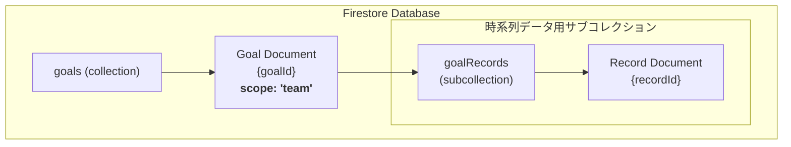

# 「組織単位の目標設定」機能仕様書 (v2)

## 1. 概要

このドキュメントは、管理者向け画面および従業員向けアプリにおける**組織単位**（部署・チーム）の目標設定機能に関する、データモデル、主要ロジック、および画面仕様を定義します。

この機能により、`org_personal_goal_setting`権限を持つユーザー（主にマネージャー）は、自身が所属する組織、およびその配下のすべての組織の目標を柔軟に設定・管理し、その進捗を追跡できます。従業員は、所属組織の目標とその達成状況をダッシュボードで視覚的に確認できます。

---

## 2. データベース設計 (Firestore)

本機能は、既存の`goals`コレクションと、各目標に紐づくサブコレクションによってデータを管理します。

### 2.1. コレクション階層図



### 2.2. `goals` コレクション

*   **コレクションパス**: `/goals`
*   **目的**: 会社・組織・個人のすべての目標設定情報を格納します。`scope: 'team'`のドキュメントが組織単位の目標に該当します。

#### データモデル (`Goal`) - `scope: 'team'`の場合

```typescript
{
  // --- 基本情報 ---
  id: string;          // ドキュメントID
  title: string;       // 目標のタイトル (例: "四半期新規契約数")
  scope: "team";       // 'team' に固定
  scopeId: string;     // 紐づく組織(Organization)のID
  authorId: string;    // 作成・最終更新者のUID
  
  // --- 表示設定 ---
  chartType: "donut" | "bar" | "line" | "composed";
  status: "active" | "inactive"; // 従業員向けアプリでの表示/非表示
  unit: "%" | "件" | "円" | "百万円"; // 値の単位

  // --- 期間設定 ---
  startDate: Timestamp; // 目標期間の開始日
  endDate: Timestamp;   // 目標期間の終了日

  // --- 目標値 ---
  targetValue: number; // 期間全体の目標値

  // --- デフォルト表示設定 (従業員向けアプリ用) ---
  defaultGranularity: 'daily' | 'weekly' | 'monthly'; // デフォルトの時間軸
  defaultIsCumulative: boolean; // デフォルトで積み上げ表示か否か

  // --- タイムスタンプ ---
  createdAt: Timestamp;
  updatedAt: Timestamp;
}
```
*   **補足**: `chartType: 'donut'`の場合、`currentValue`フィールドがこのドキュメントに直接保存されますが、他の時系列グラフでは`goalRecords`サブコレクションを使用します。

### 2.3. `goalRecords` サブコレクション

*   **パス**: `/goals/{goalId}/goalRecords/{recordId}`
*   **目的**: `bar`, `line`, `composed` グラフで表示するための、日付単位の実績データを格納します。

#### データモデル (`GoalRecord`)

```typescript
{
  id: string;           // ドキュメントID
  date: Timestamp;      // データ記録日
  actualValue: number;  // その日時点での実績値
  authorId: string;     // データ記録者のUID
  updatedAt: Timestamp; // データ更新日時
}
```
---

## 3. 管理者向け画面の機能仕様

### 3.1. 権限管理

*   **編集権限**: `org_personal_goal_setting`権限を持つユーザーは、自身が所属する組織およびその配下のすべての組織の目標を作成・編集・削除・表示設定できます。

### 3.2. ウィジェット作成・編集フロー

1.  **基本情報入力**: `タイトル`、`対象組織`、`単位`を入力します。
2.  **グラフ種類選択**: `ドーナツ`、`棒`、`折れ線`、`複合`から選択します。
3.  **期間設定**: 目標の`開始日`と`終了日`を設定します。
4.  **目標値設定**: 期間全体で達成すべき`目標値` (`targetValue`) を入力します。
5.  **デフォルト表示設定**: `chartType`が`donut`でない場合、従業員向けアプリでの初期表示設定として「時間軸」と「実績の積み上げON/OFF」を設定します。

### 3.3. データ入力フロー

*   **ドーナツチャートの場合**: 期間全体の現在の進捗値 (`currentValue`) を直接更新します。
*   **時系列グラフ（棒・折れ線・複合）の場合**: カレンダーUIで日付を選択し、その日の「実績値」(`actualValue`) を入力・更新します。データは`goalRecords`サブコレクションに保存されます。

---

## 4. 従業員向けアプリのグラフ表示ロジック

従業員向けアプリでは、管理画面で設定された`status: 'active'`の目標ウィジェットをダッシュボードに表示します。

### 4.1. 初期表示

1.  まず、`goals`ドキュメントから`defaultGranularity`と`defaultIsCumulative`の値を読み込み、グラフの初期表示状態を決定します。
2.  ユーザーがUI上のスイッチやドロップダウンで表示を変更することも可能です。

### 4.2. 「実績を積上」スイッチの状態別 表示ルール

#### A) スイッチがOFFの場合 (期間ごとのパフォーマンス表示)

*   **目的**: 各期間（日/週/月）のパフォーマンスを個別に評価する。
*   **グラフタイプ**: **積み上げ棒グラフ**で表示。
*   **データ集計**:
    *   `日ごと`: `goalRecords`の`actualValue`をそのまま使用。
    *   `週ごと`/`月ごと`: 各期間内の`actualValue`を**合計**した値をその期間の実績とする。
*   **棒グラフの描画**:
    *   各棒は、まず「期間ごとの目標値」まで**緑色**で描画されます。
    *   実績が「期間ごとの目標値」を超えた場合、その超過分が**青色**で積み上げて描画されます。
*   **目標ライン**:
    *   `期間ごとの目標値`が、参照線としてグラフ上に点線で表示されます。
*   **計算式**:
    *   `期間ごとの目標値` = `期間全体の目標値(targetValue)` ÷ `表示されている棒の本数`
*   **ツールチップの例**:
    *   `週ごと`表示で`8/1-8/7`の棒にカーソルを合わせると → `「8月1日〜8月7日の実績: 80件」`

#### B) スイッチがONの場合 (累計進捗表示)

*   **目的**: 期間全体のゴールに対する現在の進捗状況を把握する。
*   **グラフタイプ**: `chartType`に応じて以下の通り。
*   **データ集計**:
    *   各時点までの`actualValue`をすべて**累計**して`累計実績`を計算。
    *   `累計達成率` = (`累計実績` ÷ `期間全体の目標値`) × 100
*   **グラフの描画**:
    *   **複合グラフ (`composed`)**:
        *   棒グラフで**累計実績**を表示（右肩上がりの階段状）。
        *   折れ線グラフで**累計達成率**をY軸（右）に対応させて表示。
    *   **棒グラフ (`bar`)**: 累計実績のみを棒グラフで表示。
    *   **折れ線グラフ (`line`)**: 累計実績のみを折れ線グラフで表示。
*   **目標ライン**:
    *   `期間全体の目標値(targetValue)`が、参照線としてグラフ上に点線で表示されます。
*   **ツールチップの例**:
    *   `週ごと`表示で`8/1-8/7`の棒にカーソルを合わせると → `「累計実績: 80件」「累計達成率: 8%」`

---

## 5. 【検討事項】閲覧権限

*   **現状**: 従業員がどの組織の目標まで閲覧できるかの明確なルールがありません。
*   **提案**: まずはシンプルに「**従業員は、自身が所属する組織ツリー（自部署およびその配下）の目標のみ閲覧可能**」とするのが良いでしょう。より複雑な要件（例: 他の事業部の目標も見るなど）が出てきた場合に、別途権限設定機能を拡張することを推奨します。
```