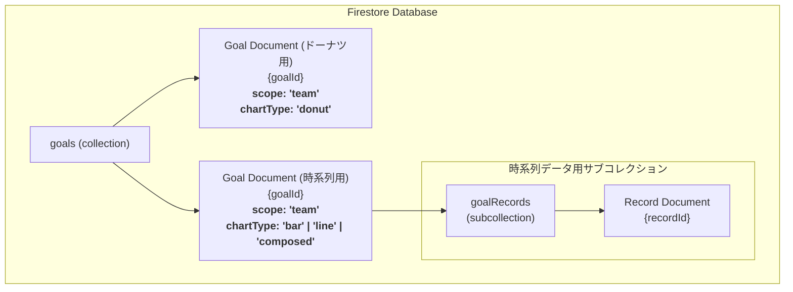

# 「組織単位の目標設定」機能仕様書 (v2)

## 1. 概要

このドキュメントは、管理者向け画面および従業員向けアプリにおける**組織単位**（部署・チーム）の目標設定機能に関する、データモデル、主要ロジック、および画面仕様を定義します。

この機能により、`org_personal_goal_setting`権限を持つユーザー（主にマネージャー）は、自身が所属する組織、およびその配下のすべての組織の目標を柔軟に設定・管理し、その進捗を追跡できます。

---

## 2. データベース設計 (Firestore)

本機能は、既存の`goals`コレクションと、各目標に紐づくサブコレクションによってデータを管理します。

### 2.1. コレクション階層図



### 2.2. `goals` コレクション

*   **コレクションパス**: `/goals`
*   **目的**: 会社・組織・個人のすべての目標設定情報を格納します。`scope: 'team'`のドキュメントが組織単位の目標に該当します。

#### データモデル (`Goal`) - `scope: 'team'`の場合

```typescript
{
  // --- 基本情報 ---
  id: string;
  title: string;       // 目標のタイトル (KPIとしても利用)
  scope: "team";
  scopeId: string;     // 紐づく組織(Organization)のID
  authorId: string;
  
  // --- 表示設定 ---
  chartType: "donut" | "bar" | "line" | "composed";
  status: "active" | "inactive";
  unit: "%" | "件" | "円" | "百万円";

  // --- 期間設定 ---
  startDate: Timestamp;
  endDate: Timestamp;

  // --- 進捗データ (グラフタイプによって使用するフィールドが異なる) ---
  
  // A) chartTypeが 'donut' の場合に使用
  targetValue?: number; // 期間全体の目標値
  currentValue?: number;// 期間全体の現在値

  // B) chartTypeが 'bar', 'line', 'composed' の場合は使用せず、
  //    'goalRecords' サブコレクションで時系列データを管理する

  // --- タイムスタンプ ---
  createdAt: Timestamp;
  updatedAt: Timestamp;
}
```

### 2.3. `goalRecords` サブコレクション

*   **パス**: `/goals/{goalId}/goalRecords/{recordId}`
*   **目的**: `bar`, `line`, `composed` グラフで表示するための、日付単位の時系列データを格納します。

#### データモデル (`GoalRecord`)

```typescript
{
  id: string;
  date: Timestamp;      // データ記録日
  targetValue: number;  // その日時点での目標値
  actualValue: number;  // その日時点での実績値
  authorId: string;     // データ記録者のUID
  updatedAt: Timestamp; // データ更新日時
}
```

---

## 3. 機能仕様・ロジック

### 3.1. 権限管理

*   **編集権限**: `org_personal_goal_setting`権限を持つユーザーは、自身が所属する組織およびその配下のすべての組織の目標を作成・編集・削除・表示設定できます。

### 3.2. 管理画面のフロー

#### 3.2.1. ウィジェット作成フロー

1.  **基本情報入力**:
    *   `タイトル`（例: "四半期新規契約数"）、`対象組織`、`単位`（件, %, 円, 百万円）を入力します。
2.  **グラフ種類選択**:
    *   `ドーナツ`、`棒`、`折れ線`、`複合`からグラフの種類を選択します。
3.  **期間設定**:
    *   目標の`開始日`と`終了日`を設定します。
4.  **目標値設定（ドーナツチャートの場合のみ）**:
    *   グラフに`ドーナツ`を選択した場合、期間全体の`目標値` (`targetValue`) を入力します。

#### 3.2.2. データ入力フロー

*   各ウィジェットのメニューから「データ編集」を選択します。
*   **ドーナツチャートの場合**:
    *   現在の進捗値 (`currentValue`) を更新するためのシンプルな入力欄が表示されます。
*   **棒・折れ線・複合グラフの場合**:
    *   カレンダーとテーブルを組み合わせたUIが表示されます。
    *   ユーザーは日付を選択し、その日の「目標値」と「実績値」を入力・更新できます。
    *   記録されたデータは `goalRecords` サブコレクションに保存されます。

### 3.3. グラフ表示ロジック

*   **ドーナツチャート (`donut`)**:
    *   `targetValue`に対する`currentValue`の割合を計算し、進捗率として表示します。
*   **棒グラフ (`bar`)**:
    *   `goalRecords`からデータを取得し、目標期間に応じて週次または月次に自動集計します。
    *   集計した「目標値」と「実績値」を棒グラフで表示します。
*   **折れ線グラフ (`line`)**:
    *   `goalRecords`からデータを取得し、目標期間に応じて週次または月次に自動集計します。
    *   集計した**「実績値」**の推移を折れ線グラフで表示します。
*   **複合グラフ (`composed`)**:
    *   `goalRecords`からデータを取得し、目標期間に応じて週次または月次に自動集計します。
    *   **棒グラフ部分**: 集計した「目標値」と「実績値」を表示します。
    *   **折れ線グラフ部分**: 上記の目標値と実績値から**達成率を自動で計算**し、それを第二軸として折れ線グラフで表示します。
