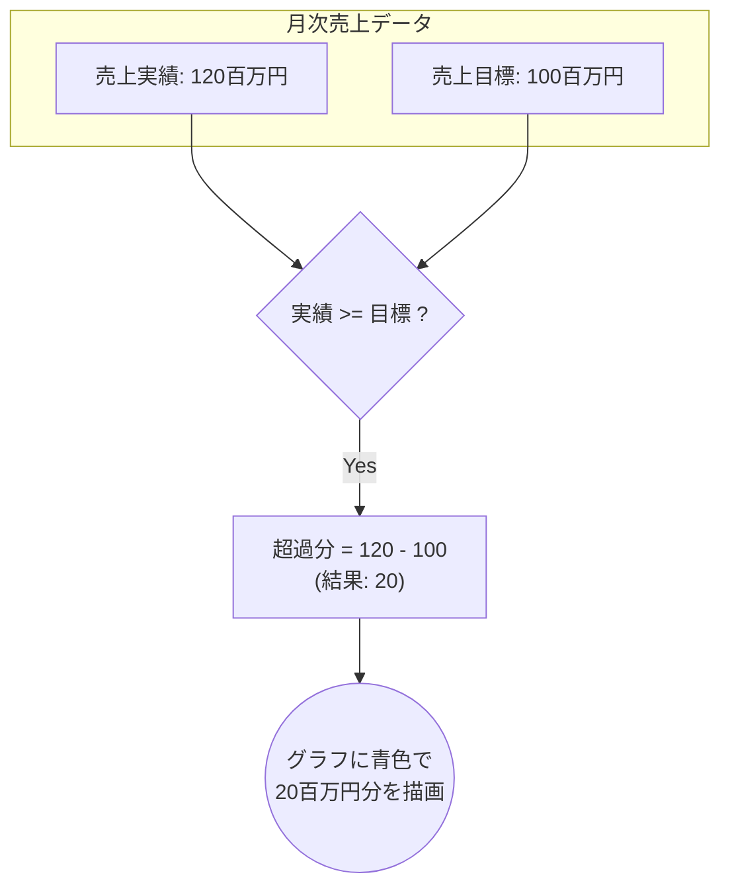
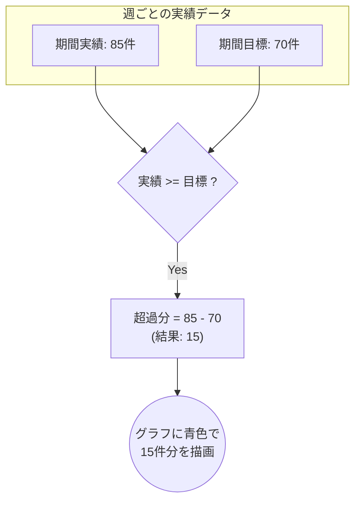

# 「超過達成」の計算ロジックとグラフ表示仕様

## 1. 概要

このドキュメントは、Philosのダッシュボード機能における各種目標グラフで、「超過達成」を示す青色のグラフ部分が、どのような計算ロジックに基づいて算出・描画されるかを技術的に解説します。

超過達成の計算は、主に以下の2つのグラフで利用されます。

1.  **会社単位の売上目標グラフ** (`kpi: 'sales_revenue'`)
2.  **組織単位の期間別目標グラフ** (`scope: 'team'`, `実績を積上`スイッチOFF時)

これらの計算ロジックと描画処理は、主に `src/components/dashboard/widget-preview.tsx` コンポーネント内で実装されています。

---

## 2. 計算ロジック詳細

### 2.1. 会社単位の売上目標グラフ

このグラフでは、各月の「売上実績」が「売上目標」を上回った場合に、その差分が「超過分」として計算されます。

-   **対象コンポーネント**: `ActualSalesComposedChart`, `ActualSalesBarChart`
-   **関連フィールド**:
    -   `salesActual`: 売上実績
    -   `salesTarget`: 売上目標
-   **計算式**:

    ```javascript
    // グラフ描画用のデータ加工ロジック内
    if (salesActual >= salesTarget) {
      // 目標を達成または超過した場合
      over = salesActual - salesTarget; // 超過分を計算
      base = salesTarget;             // グラフの土台は目標値
    } else {
      // 目標未達の場合
      over = 0;                       // 超過分は0
      base = salesActual;             // グラフの土台は実績値
    }
    ```

-   **グラフ描画**:
    -   `base`（実績 or 目標値）が緑色の棒グラフで描画されます。
    -   `over`（超過分）が**0より大きい場合**、`base`の上に青色の棒グラフとして積み重ねて描画されます。



### 2.2. 組織単位の期間別目標グラフ

このグラフは、「実績を積上」スイッチが**OFF**の時に表示され、各期間（日/週/月）ごとのパフォーマンスを示します。ここでの超過分は、「期間ごとの実績」が「期間ごとの目標」を上回った場合に計算されます。

-   **対象コンポーネント**: `TeamGoalPeriodicBarChart`
-   **関連フィールド**:
    -   `periodActual`: 期間ごとの実績合計
    -   `periodTarget`: 期間ごとの目標値
-   **計算式**:

    ```javascript
    // グラフ描画用のデータ加工ロジック内

    // 期間ごとの目標値の計算
    periodTarget = 期間全体の目標値 / 表示されている棒の本数;
    
    // 超過分の計算
    if (periodActual >= periodTarget) {
      // 期間目標を達成または超過した場合
      over = periodActual - periodTarget; // 超過分を計算
      base = periodTarget;              // グラフの土台は期間目標値
    } else {
      // 期間目標が未達の場合
      over = 0;                         // 超過分は0
      base = periodActual;              // グラフの土台は期間実績値
    }
    ```

-   **グラフ描画**:
    -   `base`が緑色の棒グラフで描画されます。
    -   `over`（超過分）が**0より大きい場合**、`base`の上に青色の棒グラフとして積み重ねて描画されます。
    -   `periodTarget`の値は、参照線（点線）としてもグラフ上に表示されます。



---

このドキュメントが、超過達成分の計算ロジックに関する理解の一助となれば幸いです。