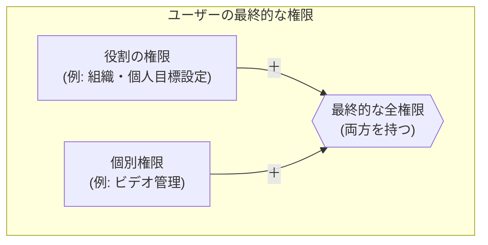

# 「権限管理」機能 設計仕様書

## 1. 概要

このドキュメントは、Philosアプリケーションにおける、柔軟かつ拡張性の高い権限管理システムの設計と実装について定義します。このシステムは、「役割（ロール）ベース」の権限と「ユーザー個別」の権限を組み合わせることで、きめ細やかなアクセス制御を実現します。

---

## 2. 権限の基本概念

Philosの権限システムは、以下の2つの要素から成り立っています。

1.  **役割（Role）**:
    *   「管理者」「経営層」「マネージャー」「従業員」といった、ユーザーの職務や立場に基づいた権限のテンプレートです。
    *   各役割には、アクセス可能な機能（メニュー）のリストが事前に定義されています。

2.  **個別権限（Individual Permission）**:
    *   役割が持つ権限に加えて、特定のユーザーにのみ追加で付与される特別な権限です。
    *   例えば、「通常はマネージャーだが、特別にコンテンツ管理の権限も持たせたい」といった例外的なケースに対応できます。

ユーザーが最終的に持つ権限は、**「そのユーザーの役割が持つ権限」**と**「個人に付与された追加権限」**を合算したものになります。



---

## 3. データベース設計 (Firestore)

権限システムは、主に以下の3つのコレクションで構成されます。

### 3.1. `roles` コレクション

*   **コレクションパス**: `/roles`
*   **ドキュメントID**: 役割のID (例: `admin`, `executive`)
*   **目的**: 各役割がどの権限を持つかを定義します。

**▼ データモデル (`Role`)**

```typescript
{
  "id": "executive",          // ドキュメントID (役割のID)
  "name": "経営層",           // 役割の表示名
  "permissions": [            // この役割が持つ権限キーの配列
    "video_management",
    "message_management",
    "company_goal_setting",
    "org_personal_goal_setting",
    ...
  ]
}
```

### 3.2. `user_permissions` コレクション

*   **コレクションパス**: `/user_permissions`
*   **ドキュメントID**: ユーザーのUID (`userId`)
*   **目的**: ユーザー個人に付与された追加の権限を格納します。

**▼ データモデル (`UserPermission`)**

```typescript
{
  "id": "abcdef12345",         // ドキュメントID (ユーザーのUID)
  "userId": "abcdef12345",      // 対象ユーザーのUID
  "permissions": [              // このユーザーだけに追加される権限
    "video_management"
  ],
  "updatedAt": Timestamp,       // 最終更新日時
  "updatedBy": "admin_uid_xyz"  // 最終更新者のUID
}
```

### 3.3. `users` コレクション

*   **コレクションパス**: `/users`
*   **ドキュメントID**: ユーザーのUID (`userId`)
*   **目的**: 各ユーザーがどの「役割」に属しているかを定義します。

**▼ データモデル (`Member`)**
(関連フィールドのみ抜粋)

```typescript
{
  "uid": "abcdef12345",
  "displayName": "田中 太郎",
  "role": "manager",  // `/roles`コレクションの'manager'ドキュメントを参照
  ...
}
```

---

## 4. 権限判定ロジックとUIへの反映

### 4.1. 権限の判定フロー

ユーザーがログインすると、アプリケーションは以下の手順でそのユーザーの全権限を確定させます。

```mermaid
graph TD
    A[ユーザーログイン] --> B{ユーザーの役割(role)を取得<br>from: /users/{userId}};
    B --> C{役割に対応する権限リストを取得<br>from: /roles/{roleId}};
    
    A --> D{ユーザー個別の追加権限を取得<br>from: /user_permissions/{userId}};
    
    C --> E["役割の権限リスト"];
    D --> F["個別の権限リスト"];
    
    E --> G{2つのリストを結合し、<br>重複を除外};
    F --> G;
    
    G --> H[最終的な権限セットが確定];
```

### 4.2. 管理画面UIへの反映

確定した権限セットに基づき、管理画面のUIが動的に変化します。

*   **サイドバー**:
    *   `src/app/dashboard/layout.tsx` 内で、ユーザーが権限を持つメニュー項目のみがサイドバーに表示されます。権限のない項目は非表示になります。
    *   例えば、`video_management` と `message_management` のどちらの権限も持たないユーザーには、「コンテンツ管理」メニュー自体が表示されません。

*   **タブの表示/非表示**:
    *   `src/app/dashboard/contents/page.tsx` や `src/app/dashboard/dashboard/page.tsx` など、1ページ内に複数の機能タブがある画面では、権限に応じてタブが表示されたり非表示になったりします。
    *   例: `video_management` 権限しか持たないユーザーには、「コンテンツ管理」画面の「ビデオ管理」タブのみが表示されます。

*   **操作ボタンの無効化**:
    *   権限は主に画面や機能単位の「表示/非表示」を制御しますが、将来的には、一覧は見せつつ「編集」や「削除」ボタンのみを非活性化する、といったより細かい制御にも利用できます。

---

## 5. 権限キー一覧と各画面での動き

| 権限キー | 説明 | 主な対象ロール | 管理者側の動き | 従業員側の動き |
| :--- | :--- | :--- | :--- | :--- |
| `members` | メンバーの閲覧・追加・編集・削除 | **管理者** | **[表示]** サイドバーに「メンバー管理」表示<br>**[操作]** `/dashboard/members`ですべての操作が可能 | (本機能は従業員向けアプリには存在しない) |
| `organization` | 組織階層の作成や編集 | **管理者** | **[表示]** サイドバーに「組織管理」表示<br>**[操作]** `/dashboard/organization`ですべての操作が可能 | (本機能は従業員向けアプリには存在しない) |
| `permissions` | 権限管理ページ自体へのアクセス | **管理者** | **[表示]** サイドバーに「権限管理」表示<br>**[操作]** `/dashboard/permissions`で役割や個別権限を編集可能 | (本機能は従業員向けアプリには存在しない) |
| `video_management` | ビデオコンテンツの管理 | **経営層** | **[表示]** サイドバーに「コンテンツ管理」表示<br>**[操作]** `/dashboard/contents`の「ビデオ管理」タブでCRUD操作が可能 | **[表示]** 公開されたビデオコンテンツを閲覧・コメント・いいねできる<br>**[操作]** 全ユーザーがコメント投稿可能<br>**(将来実装)** 権限を持つユーザーはアプリ上から投稿・編集が可能<br>**(将来実装)** コメントへの返信は`admin`, `executive`ロール、およびコンテンツ投稿者のみ可能 |
| `message_management` | 経営層メッセージの管理 | **経営層** | **[表示]** サイドバーに「コンテンツ管理」表示<br>**[操作]** `/dashboard/contents`の「メッセージ管理」タブでCRUD操作が可能 | **[表示]** 公開された経営層メッセージを閲覧・コメント・いいねできる<br>**[操作]** 全ユーザーがコメント投稿可能<br>**(将来実装)** 権限を持つユーザーはアプリ上から投稿・編集が可能<br>**(将来実装)** コメントへの返信は`admin`, `executive`ロール、およびコンテンツ投稿者のみ可能 |
| `philosophy` | 理念・ビジョンの編集 | **経営層** | **[表示]** サイドバーに「理念管理」表示<br>**[操作]** `/dashboard/philosophy`で内容を編集可能 | **[表示]** 全ユーザーが従業員向けアプリの「理念・ビジョン」ページで内容を閲覧できる (編集不可) |
| `calendar` | 行動指針カレンダーのメッセージ設定 | **経営層** | **[表示]** サイドバーに「カレンダー設定」表示<br>**[操作]** `/dashboard/calendar`で日替わり・期間指定メッセージを編集可能 | **[表示]** 全ユーザーが従業員向けアプリのカレンダーページで、設定されたメッセージを閲覧できる (編集不可) |
| `company_goal_setting` | **会社単位**の目標（ウィジェット）の設定 | **経営層** | **[表示]** サイドバーに「目標設定」表示<br>**[操作]** `/dashboard/dashboard`の「会社単位」タブでウィジェットの作成・データ編集・表示設定が可能 | **[表示]** 全ユーザーが従業員向けダッシュボードで、`active`状態の会社目標グラフを閲覧できる (編集不可) |
| `org_personal_goal_setting` | **組織単位・個人単位**の目標を設定する機能 | **マネージャー** | **[表示]** サイドバーに「目標設定」表示<br>**[操作]** `/dashboard/dashboard`の「組織単位」「個人単位」タブで目標を編集・閲覧可能 | **[表示]** 自分の個人目標や所属組織の目標を閲覧できる。他ユーザーの目標は編集できない<br>**[操作]** 自分の個人目標は誰でも作成・編集可能。組織目標は権限を持つユーザーのみアプリから編集可能 |
| `ranking` | ランキング設定 | **(未定)** | **[表示]** サイドバーに「ランキング設定」表示 | **[表示]** 全ユーザーが設定されたランキングを閲覧できる (編集不可) |
