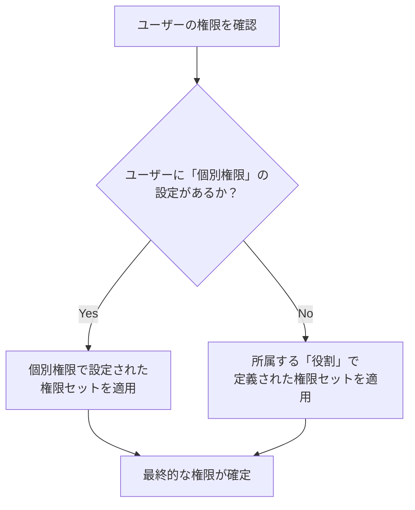

# 「権限管理」機能 設計仕様書 (v2)

## 1. 概要

このドキュメントは、Philosアプリケーションにおける、柔軟かつ拡張性の高い権限管理システムの設計と実装について定義します。このシステムは、「役割（ロール）ベース」の権限と、「ユーザー個別」の権限設定を組み合わせることで、きめ細やかなアクセス制御を実現します。

---

## 2. 権限の基本概念

Philosの権限システムは、以下の2つの要素から成り立っています。

1.  **役割（Role）**:
    *   「管理者」「経営層」「マネージャー」「従業員」といった、ユーザーの職務や立場に基づいた権限のテンプレートです。
    *   各役割には、アクセス可能な機能（メニュー）のリストが事前に定義されています。

2.  **個別権限（Individual Permission）**:
    *   特定のユーザーに対して、役割の権限とは独立した、完全な権限セットを割り当てるための設定です。
    *   **個別権限が設定されたユーザーは、役割の権限を無視し、個別設定された権限のみが適用されます。**

ユーザーが最終的に持つ権限は、以下の優先順位で決定されます。



---

## 3. データベース設計 (Firestore)

権限システムは、主に以下の3つのコレクションで構成されます。

### 3.1. `roles` コレクション

*   **コレクションパス**: `/roles`
*   **ドキュメントID**: 役割のID (例: `admin`, `executive`)
*   **目的**: 各役割がどの権限を持つかの**デフォルト設定**を定義します。

**▼ データモデル (`Role`)**

```typescript
{
  "id": "executive",          // ドキュメントID (役割のID)
  "name": "経営層",           // 役割の表示名
  "permissions": [            // この役割が持つ権限キーの配列
    "video_management",
    "message_management",
    ...
  ]
}
```

### 3.2. `user_permissions` コレクション

*   **コレクションパス**: `/user_permissions`
*   **ドキュメントID**: ユーザーのUID (`userId`)
*   **目的**: **役割設定を上書き**するための、ユーザー個別の完全な権限セットを格納します。ここにドキュメントが存在する場合、そのユーザーの権限はこの設定によってのみ決定されます。

**▼ データモデル (`UserPermission`)**

```typescript
{
  "id": "abcdef12345",         // ドキュメントID (ユーザーのUID)
  "userId": "abcdef12345",      // 対象ユーザーのUID
  "permissions": [              // このユーザーが持つ全ての権限
    "org_personal_goal_setting",
    "video_management"
  ],
  "updatedAt": Timestamp,       // 最終更新日時
  "updatedBy": "admin_uid_xyz"  // 最終更新者のUID
}
```

### 3.3. `users` コレクション

*   **コレクションパス**: `/users`
*   **ドキュメントID**: ユーザーのUID (`userId`)
*   **目的**: 各ユーザーがどの「役割」に属しているかを定義します。これは、個別権限が設定されていない場合のフォールバックとして使用されます。

**▼ データモデル (`Member`)** (関連フィールドのみ抜粋)

```typescript
{
  "uid": "abcdef12345",
  "displayName": "田中 太郎",
  "role": "manager",  // `/roles`コレクションの'manager'ドキュメントを参照
  ...
}
```

---

## 4. 権限判定ロジックとUIへの反映

### 4.1. 権限の判定フロー

ユーザーがログインすると、アプリケーションは以下の手順でそのユーザーの全権限を確定させます。

```mermaid
graph TD
    A[ユーザーログイン] --> B{ユーザーの「個別権限」設定は<br>存在するか？<br>(in /user_permissions/{userId})};
    B -- Yes --> C{個別権限のリストを取得し、<br>それを最終的な権限とする};
    B -- No --> D{ユーザーの役割(role)を取得<br>(from /users/{userId})};
    D --> E{役割に対応する権限リストを取得<br>(from /roles/{roleId})};
    E --> F[役割の権限を最終的な権限とする];
    
    C --> G[最終的な権限セットが確定];
    F --> G;
```

### 4.2. 管理画面UIへの反映

管理者画面 (`/dashboard/permissions`) は、権限を管理するための2つのタブで構成されます。

#### 4.2.1. 「役割別権限」タブ

*   役割（行）と権限（列）のマトリクス表形式で、各役割のデフォルト権限を一覧・編集できます。
*   「管理者」ロールは常に全ての権限を持つため編集不可です。
*   ここで設定を変更すると、個別権限を持たない全てのユーザーに影響します。

#### 4.2.2. 「ユーザー個別権限」タブ

*   **全ユーザー**（行）と権限（列）のマトリクス表形式で、ユーザー一人ひとりの最終的な権限を直接確認・編集できます。
*   **表示ロジック**:
    *   ユーザーに個別権限設定が存在する場合、その設定がチェックボックスに反映されます。
    *   ユーザーに個別権限設定が存在しない場合、そのユーザーの**役割が持つ権限が、デフォルトとしてチェックされた状態で表示されます。**
*   **編集ロジック**:
    *   管理者がこのタブでいずれかのユーザーのチェックボックスを一つでも変更して保存すると、その瞬間にそのユーザーの「個別権限」設定が作成（または更新）されます。
    *   以降、そのユーザーの権限は、役割の設定から完全に独立し、この個別設定によってのみ管理されるようになります。
*   **個別設定のリセット**:
    *   ユーザー名の横にあるメニューから「個別設定をリセット」を選択すると、`user_permissions`コレクションからそのユーザーのドキュメントが削除されます。
    *   これにより、ユーザーは再び所属する役割のデフォルト権限に従う状態に戻ります。

---

## 5. 権限キー一覧と各画面での動き

| 権限キー | 説明 | 主な対象ロール | 管理者側の動き | 従業員側の動き |
| :--- | :--- | :--- | :--- | :--- |
| `members` | メンバーの閲覧・追加・編集・削除 | **管理者** | **[表示]** サイドバーに「メンバー管理」表示<br>**[操作]** `/dashboard/members`ですべての操作が可能 | (本機能は従業員向けアプリには存在しない) |
| `organization` | 組織階層の作成や編集 | **管理者** | **[表示]** サイドバーに「組織管理」表示<br>**[操作]** `/dashboard/organization`ですべての操作が可能 | (本機能は従業員向けアプリには存在しない) |
| `permissions` | 権限管理ページ自体へのアクセス | **管理者** | **[表示]** サイドバーに「権限管理」表示<br>**[操作]** `/dashboard/permissions`で役割や個別権限を編集可能 | (本機能は従業員向けアプリには存在しない) |
| `video_management` | ビデオコンテンツの管理 | **経営層** | **[表示]** サイドバーに「コンテンツ管理」表示<br>**[操作]** `/dashboard/contents`の「ビデオ管理」タブでCRUD操作が可能 | **[表示]** 公開されたビデオコンテンツを閲覧・コメント・いいねできる<br>**[操作]** 全ユーザーがコメント投稿可能。**管理者(admin)と経営層(executive)のみコメントへの返信が可能。** |
| `message_management` | 経営層メッセージの管理 | **経営層** | **[表示]** サイドバーに「コンテンツ管理」表示<br>**[操作]** `/dashboard/contents`の「メッセージ管理」タブでCRUD操作が可能 | **[表示]** 公開された経営層メッセージを閲覧・コメント・いいねできる<br>**[操作]** 全ユーザーがコメント投稿可能。**管理者(admin)と経営層(executive)のみコメントへの返信が可能。** |
| `philosophy` | 理念・ビジョンの編集 | **経営層** | **[表示]** サイドバーに「理念管理」表示<br>**[操作]** `/dashboard/philosophy`で内容を編集可能 | **[表示]** 全ユーザーが従業員向けアプリの「理念・ビジョン」ページで内容を閲覧できる (編集不可) |
| `calendar` | 行動指針カレンダーのメッセージ設定 | **経営層** | **[表示]** サイドバーに「カレンダー設定」表示<br>**[操作]** `/dashboard/calendar`で日替わり・期間指定メッセージを編集可能 | **[表示]** 全ユーザーが従業員向けアプリのカレンダーページで、設定されたメッセージを閲覧できる (編集不可) |
| `company_goal_setting` | **会社単位**の目標（ウィジェット）の設定 | **経営層** | **[表示]** サイドバーに「目標設定」表示<br>**[操作]** `/dashboard/dashboard`の「会社単位」タブでウィジェットの作成・データ編集・表示設定が可能 | **[表示]** 全ユーザーが従業員向けダッシュボードで、`active`状態の会社目標グラフを閲覧できる (編集不可) |
| `org_personal_goal_setting` | **組織単位・個人単位**の目標を設定する機能 | **マネージャー** | **[表示]** サイドバーに「目標設定」表示<br>**[操作]** `/dashboard/dashboard`の「組織単位」「個人単位」タブで目標を編集・閲覧可能 | **[表示]** 自分の個人目標や所属組織の目標を閲覧できる。他ユーザーの目標は編集できない<br>**[操作]** 自分の個人目標は誰でも作成・編集可能。 |
| `ranking` | ランキング設定 | **(未定)** | **[表示]** サイドバーに「ランキング設定」表示 | **[表示]** 全ユーザーが設定されたランキングを閲覧できる (編集不可) |
