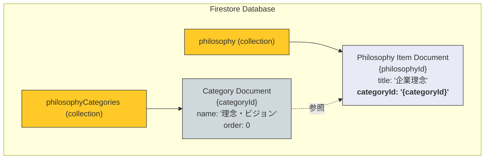

# 「理念・ビジョン」機能 DB構造仕様書

## 1. 概要

このドキュメントは、「理念・ビジョン」機能における、カテゴリと個別の項目を管理するための新しいFirestoreデータベース構造について解説します。

この構造では、「理念カテゴリ」と「理念項目」をそれぞれ別のコレクションで管理することにより、管理者様がカテゴリを自由に作成・編集できる、より柔軟で拡張性の高いシステムを実現しています。

---

## 2. コレクション階層図



---

## 3. コレクション詳細

### 3.1. `philosophyCategories` (理念カテゴリ)

*   **コレクションパス**: `/philosophyCategories`
*   **ドキュメントID**: 自動生成
*   **目的**:
    *   「理念・ビジョン」や「考え方の継承」といった、理念項目をグループ化するための**大枠（カテゴリ）**を管理します。
    *   管理者は、このコレクションを通じてカテゴリを新規作成、編集、削除、並べ替えすることができます。

#### データモデル (`PhilosophyCategory`)

```typescript
{
  "id": string;      // ドキュメントID
  "name": string;    // カテゴリの表示名 (例: "理念・ビジョン")
  "order": number;   // カテゴリ自体の表示順序（昇順）
  "createdAt": Timestamp;
  "updatedAt": Timestamp;
}
```

### 3.2. `philosophy` (理念項目)

*   **コレクションパス**: `/philosophy`
*   **ドキュメントID**: 自動生成
*   **目的**:
    *   「企業理念」や「コーポレートステートメント」といった、**個別の理念項目**の具体的な内容を管理します。
    *   各項目は `categoryId` フィールドを持つことで、いずれかのカテゴリに所属します。

#### データモデル (`PhilosophyItem`)

```typescript
{
  "id": string;         // ドキュメントID
  "title": string;      // 項目のタイトル (例: "企業理念")
  "content": string;    // 項目の内容 (リッチテキスト形式のHTML)
  "icon": string;       // Lucideアイコン名
  "order": number;      // カテゴリ内での表示順序（昇順）
  "categoryId": string; // 所属するカテゴリのID (`philosophyCategories`のドキュメントIDへの参照)
  "createdAt": Timestamp;
  "updatedAt": Timestamp;
}
```

この設計により、理念の体系全体を管理者様が柔軟に構築・変更することが可能になっています。
