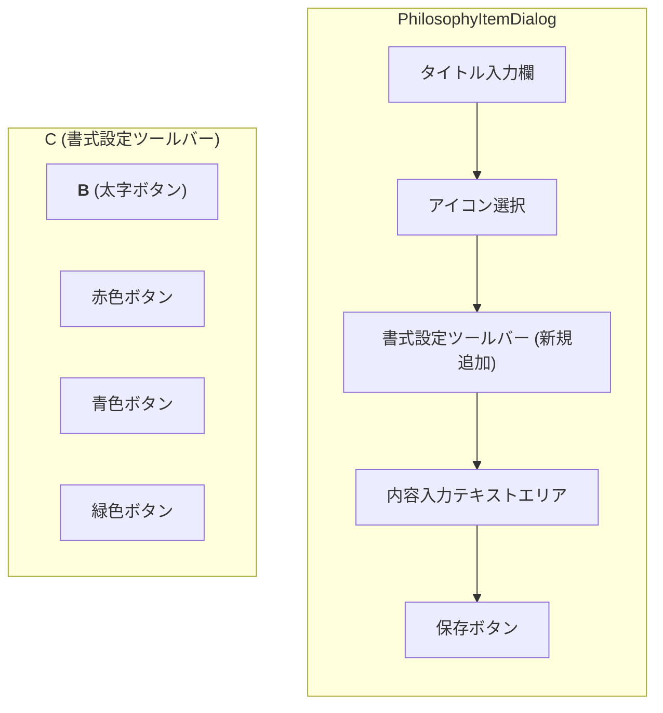

# 「理念管理」簡易リッチテキストエディタ 実装仕様書

## 1. 概要

このドキュメントは、管理者向け画面の「理念管理」機能 (`/dashboard/philosophy`) において、内容入力欄（テキストエリア）を拡張し、ボタン操作で安全に文字の書式（太字、色）を設定できる簡易的なリッチテキストエディタ機能の実装仕様を定義します。

手動でのHTMLタグ入力を不要とし、より直感的なコンテンツ作成体験を提供することを目的とします。

---

## 2. 対象画面

*   **ファイル**: `src/app/dashboard/philosophy/page.tsx`
*   **コンポーネント**: `PhilosophyItemDialog`

---

## 3. UIの変更点

既存の内容入力用`<Textarea>`コンポーネントの直上に、書式設定用のツールバーを新たに追加します。



### 3.1. ツールバーの構成要素

*   **太字ボタン**: クリックすると、選択中のテキストを太字にします。
*   **カラーパレット**: 事前定義された色（赤、青、緑など）のボタンを配置します。クリックすると、選択中のテキストの色を変更します。

---

## 4. 実装ロジック

外部のライブラリは導入せず、Reactの標準機能とJavaScriptを用いて実装します。

### 4.1. テキストエリアへの参照

*   Reactの`useRef`フックを使用し、`<textarea>`要素への直接的な参照を保持します。これにより、カーソルの選択範囲やテキスト内容をプログラムで操作できるようになります。

```tsx
// PhilosophyItemDialogコンポーネント内
const contentRef = React.useRef<HTMLTextAreaElement>(null);
```

### 4.2. テキスト加工関数の実装

*   選択範囲のテキストをHTMLタグで囲む汎用的なヘルパー関数を作成します。

```tsx
const applyFormat = (tag: 'b' | 'span', color?: string) => {
  const textarea = contentRef.current;
  if (!textarea) return;

  const start = textarea.selectionStart;
  const end = textarea.selectionEnd;
  const selectedText = textarea.value.substring(start, end);

  if (!selectedText) return; // 何も選択されていなければ処理しない

  let formattedText;
  if (tag === 'b') {
    formattedText = `<b>${selectedText}</b>`;
  } else if (tag === 'span' && color) {
    formattedText = `<span style="color: ${color};">${selectedText}</span>`;
  } else {
    return;
  }

  const newValue = 
    textarea.value.substring(0, start) +
    formattedText +
    textarea.value.substring(end);
  
  // 状態を更新してUIに反映させる
  setContent(newValue);
};
```

### 4.3. ボタンへのイベントハンドラ設定

*   ツールバーの各ボタンの`onClick`イベントに、上で定義した`applyFormat`関数を紐付けます。

```tsx
// 太字ボタン
<Button type="button" onClick={() => applyFormat('b')}><b>B</b></Button>

// 赤色ボタン
<Button type="button" onClick={() => applyFormat('span', 'red')}>赤</Button>
```

---

## 5. データの保存と表示

*   **保存**: 加工された文字列（例: `情報技術で<b>笑顔</b>を創る`）が、そのままFirestoreの`content`フィールドに保存されます。
*   **表示 (管理者画面)**:
    *   管理者画面の編集ダイアログ内では、HTMLタグを含んだ生の文字列がテキストエリアに表示されます。
    *   一覧表示部分 (`SortableItem`) では、意図しないスクリプトの実行を防ぐため、HTMLタグを除去したプレーンテキストとして表示するか、`dangerouslySetInnerHTML`を使用して安全にレンダリングします。（後者を採用する場合、サニタイズ処理の検討が必要です）
*   **表示 (従業員向け画面)**:
    *   従業員向けアプリ側でこのデータを表示する際は、`dangerouslySetInnerHTML`を使用してHTMLを解釈し、スタイルが適用された状態で表示します。

この実装により、安全性を確保しつつ、直感的で使いやすい編集機能を提供します。