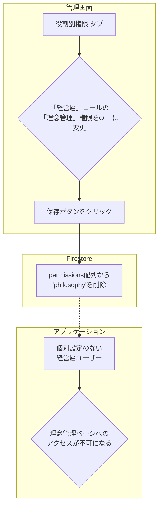

# 「役割別権限」機能 設計仕様書

## 1. 概要

このドキュメントは、Philosアプリケーションにおける「役割（ロール）ベース」の権限管理機能について詳述します。この機能は、ユーザーの職務や立場（管理者、経営層など）に基づいて、アクセス可能な機能を一元的に管理するための基本的な仕組みです。

---

## 2. 基本概念

- **役割（Role）**: 「管理者」「経営層」「マネージャー」「従業員」といった、ユーザーの立場に基づいた権限の**テンプレート**です。
- **デフォルト設定**: 各ユーザーは必ずいずれかの役割に所属します。**「ユーザー個別権限」が設定されていない限り**、ユーザーはこの役割に定義された権限セットを自動的に継承します。

---

## 3. データベース設計 (`roles` コレクション)

役割ごとの権限設定は、Firestoreの`roles`コレクションに保存されます。

- **コレクションパス**: `/roles`
- **ドキュメントID**: 役割のID (例: `admin`, `executive`)
- **目的**: 各役割がどの機能（権限キー）にアクセスできるかのデフォルト設定を定義します。

**▼ データモデル (`Role`)**

```typescript
{
  "id": "executive",          // ドキュメントID (役割のID)
  "name": "経営層",           // 役割の表示名
  "permissions": [            // この役割が持つ権限キーの配列
    "video_management",
    "message_management",
    "company_goal_setting",
    ...
  ]
}
```

---

## 4. 管理画面での操作

管理者画面の「権限管理」ページにある**「役割別権限」タブ**で、これらの設定を管理します。

- **マトリクス表示**: 役割（行）と権限（列）のマトリクス表形式で、現在の設定が一覧表示されます。
- **権限の編集**: チェックボックスをON/OFFすることで、各役割が持つ権限を直感的に変更できます。
- **保存**: 「役割権限を保存」ボタンをクリックすると、変更内容が`roles`コレクションに保存されます。
- **影響範囲**: ここでの変更は、**個別権限を持たないすべてのユーザー**に即座に影響します。
- **「管理者」ロールの特別扱い**: 「管理者」ロールは常に全ての権限を持つため、UI上では編集不可（チェックボックスが無効化）になっています。


