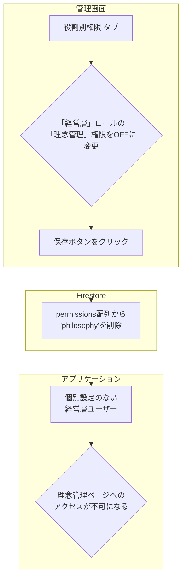

# 「役割別権限」機能 設計仕様書

## 1. 概要

このドキュメントは、Philosアプリケーションにおける「役割（ロール）ベース」の権限管理機能について詳述します。この機能は、ユーザーの職務や立場（管理者、経営層など）に基づいて、アクセス可能な機能を一元的に管理するための基本的な仕組みです。

---

## 2. 基本概念

- **役割（Role）**: 「管理者」「経営層」「マネージャー」「従業員」といった、ユーザーの立場に基づいた権限の**テンプレート**です。
- **デフォルト設定**: 各ユーザーは必ずいずれかの役割に所属します。**「ユーザー個別権限」が設定されていない限り**、ユーザーはこの役割に定義された権限セットを自動的に継承します。

---

## 3. データベース設計 (`roles` コレクション)

役割ごとの権限設定は、Firestoreの`roles`コレクションに保存されます。

- **コレクションパス**: `/roles`
- **ドキュメントID**: 役割のID (例: `admin`, `executive`)
- **目的**: 各役割がどの機能（権限キー）にアクセスできるかのデフォルト設定を定義します。

**▼ データモデル (`Role`)**

```typescript
{
  "id": "executive",          // ドキュメントID (役割のID)
  "name": "経営層",           // 役割の表示名
  "permissions": [            // この役割が持つ権限キーの配列
    "video_management",
    "message_management",
    "company_goal_setting",
    ...
  ]
}
```

---

## 4. 管理画面での操作

管理者画面の「権限管理」ページにある**「役割別権限」タブ**で、これらの設定を管理します。

- **マトリクス表示**: 役割（行）と権限（列）のマトリクス表形式で、現在の設定が一覧表示されます。
- **権限の編集**: チェックボックスをON/OFFすることで、各役割が持つ権限を直感的に変更できます。
- **保存**: 「役割権限を保存」ボタンをクリックすると、変更内容が`roles`コレクションに保存されます。
- **影響範囲**: ここでの変更は、**個別権限を持たないすべてのユーザー**に即座に影響します。
- **「管理者」ロールの特別扱い**: 「管理者」ロールは常に全ての権限を持つため、UI上では編集不可（チェックボックスが無効化）になっています。



---

## 5. 権限キーと従業員向けアプリでの機能詳細

各権限キーは、管理者画面の機能だけでなく、従業員が利用するアプリの表示や操作にも影響します。以下にその対応関係を示します。

| 権限キー | 説明 | 主な対象ロール | 管理者側の動き | 従業員側の動き |
| :--- | :--- | :--- | :--- | :--- |
| `members` | メンバーの閲覧・追加・編集・削除 | **管理者** | **[表示]** サイドバーに「メンバー管理」表示<br>**[操作]** `/dashboard/members`ですべての操作が可能 | (本機能は従業員向けアプリには存在しない) |
| `organization` | 組織階層の作成や編集 | **管理者** | **[表示]** サイドバーに「組織管理」表示<br>**[操作]** `/dashboard/organization`ですべての操作が可能 | (本機能は従業員向けアプリには存在しない) |
| `permissions` | 権限管理ページ自体へのアクセス | **管理者** | **[表示]** サイドバーに「権限管理」表示<br>**[操作]** `/dashboard/permissions`で役割や個別権限を編集可能 | (本機能は従業員向けアプリには存在しない) |
| `video_management` | ビデオコンテンツの管理 | **経営層** | **[表示]** サイドバーに「コンテンツ管理」表示<br>**[操作]** `/dashboard/contents`の「ビデオ管理」タブでCRUD操作が可能 | **[表示]** 公開されたビデオコンテンツを閲覧・コメント・いいねできる<br>**[操作]** 全ユーザーがコメント投稿可能。**管理者(admin)と経営層(executive)のみコメントへの返信が可能。** |
| `message_management` | 経営層メッセージの管理 | **経営層** | **[表示]** サイドバーに「コンテンツ管理」表示<br>**[操作]** `/dashboard/contents`の「メッセージ管理」タブでCRUD操作が可能 | **[表示]** 公開された経営層メッセージを閲覧・コメント・いいねできる<br>**[操作]** 全ユーザーがコメント投稿可能。**管理者(admin)と経営層(executive)のみコメントへの返信が可能。** |
| `philosophy` | 理念・ビジョンの編集 | **経営層** | **[表示]** サイドバーに「理念管理」表示<br>**[操作]** `/dashboard/philosophy`で内容を編集可能 | **[表示]** 全ユーザーが従業員向けアプリの「理念・ビジョン」ページで内容を閲覧できる (編集不可) |
| `calendar` | 行動指針カレンダーのメッセージ設定 | **経営層** | **[表示]** サイドバーに「カレンダー設定」表示<br>**[操作]** `/dashboard/calendar`で日替わり・期間指定メッセージを編集可能 | **[表示]** 全ユーザーが従業員向けアプリのカレンダーページで、設定されたメッセージを閲覧できる (編集不可) |
| `company_goal_setting` | **会社単位**の目標（ウィジェット）の設定 | **経営層** | **[表示]** サイドバーに「目標設定」表示<br>**[操作]** `/dashboard/dashboard`の「会社単位」タブでウィジェットの作成・データ編集・表示設定が可能 | **[表示]** 全ユーザーが従業員向けダッシュボードで、`active`状態の会社目標グラフを閲覧できる (編集不可) |
| `org_personal_goal_setting` | **組織単位・個人単位**の目標を設定する機能 | **マネージャー** | **[表示]** サイドバーに「目標設定」表示<br>**[操作]** `/dashboard/dashboard`の「組織単位」「個人単位」タブで目標を編集・閲覧可能 | **[表示]** 自分の個人目標や所属組織の目標を閲覧できる。他ユーザーの目標は編集できない<br>**[操作]** 自分の個人目標は誰でも作成・編集可能。 |
| `ranking` | ランキング設定 | **(未定)** | **[表示]** サイドバーに「ランキング設定」表示 | **[表示]** 全ユーザーが設定されたランキングを閲覧できる (編集不可) |
