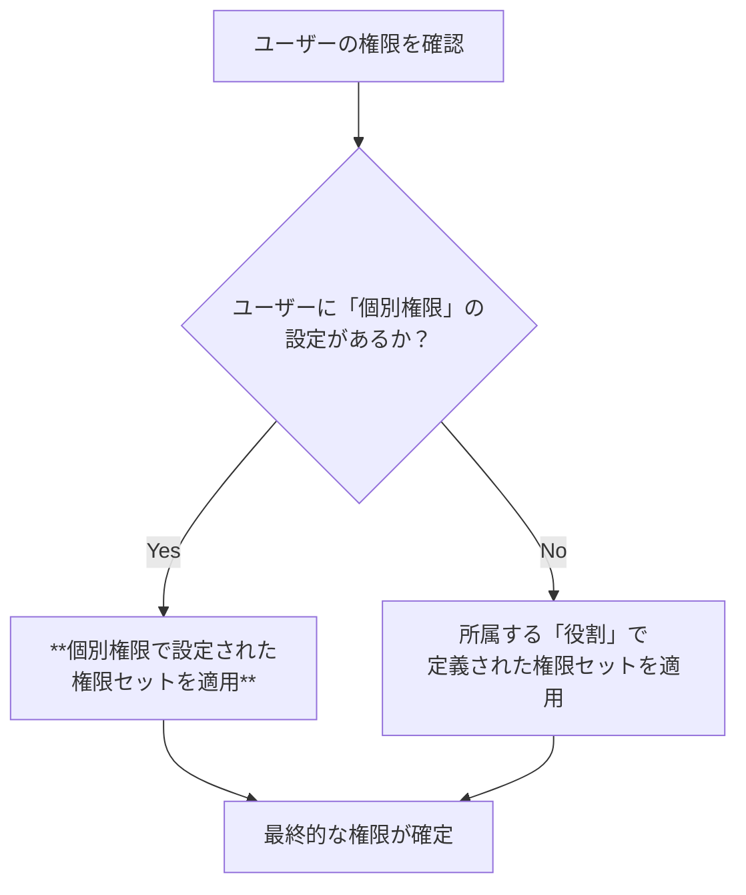

# 「ユーザー個別権限」機能 設計仕様書

## 1. 概要

このドキュメントは、Philosアプリケーションの権限管理システムにおいて、特定のユーザーに対して役割（ロール）とは独立した権限を割り当てる「ユーザー個別権限」機能について詳述します。

---

## 2. 基本概念

- **個別権限の上書き**: 「ユーザー個別権限」は、役割が持つデフォルトの権限設定を**完全に上書き**します。この設定が存在するユーザーは、所属する役割の権限を一切無視し、個別設定された権限のみが適用されます。
- **柔軟なアクセス制御**: 「マネージャーでありながら、特別にビデオ管理権限も付与する」といった、役職だけでは対応できない柔軟な権限設定を実現します。

### 権限判定の優先順位

ユーザーが最終的にどの権限を持つかは、以下の優先順位で決定されます。



---

## 3. データベース設計 (`user_permissions` コレクション)

ユーザー個別の権限設定は、Firestoreの`user_permissions`コレクションに保存されます。

- **コレクションパス**: `/user_permissions`
- **ドキュメントID**: ユーザーのUID (`userId`)
- **目的**: 役割設定を上書きするための、ユーザー個別の完全な権限セットを格納します。

**▼ データモデル (`UserPermission`)**

```typescript
{
  "id": "abcdef12345",         // ドキュメントID (ユーザーのUID)
  "userId": "abcdef12345",      // 対象ユーザーのUID
  "permissions": [              // このユーザーが持つ全ての権限
    "org_personal_goal_setting",
    "video_management"
  ],
  "updatedAt": Timestamp,       // 最終更新日時
  "updatedBy": "admin_uid_xyz"  // 最終更新者のUID
}
```

---

## 4. 管理画面での操作

管理者画面の「権限管理」ページにある**「ユーザー個別権限」タブ**で、これらの設定を管理します。

- **表示ロジック**:
    - **個別設定あり**: そのユーザーの`user_permissions`ドキュメントの内容がチェックボックスに反映されます。
    - **個別設定なし**: そのユーザーの**役割が持つ権限が、デフォルトとしてチェックされた状態で表示されます。**
- **編集ロジック（個別設定の作成）**:
    - 管理者がこのタブでユーザーの権限チェックボックスを一つでも変更して「個別権限を保存」ボタンをクリックすると、その瞬間にそのユーザーの「個別権限」設定が作成（または更新）されます。
    - 以降、そのユーザーの権限は、役割のデフォルト設定から完全に独立し、この個別設定によってのみ管理されるようになります。
- **個別設定のリセット**:
    - ユーザー名の横にあるメニューから「個別設定をリセット」を選択すると、`user_permissions`コレクションからそのユーザーのドキュメントが削除されます。
    - これにより、ユーザーは再び所属する役割のデフォルト権限に従う状態に戻ります。

