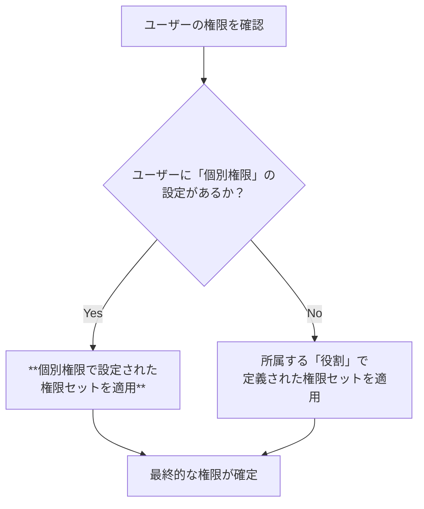

# 「ユーザー個別権限」機能 設計仕様書

## 1. 概要

このドキュメントは、Philosアプリケーションの権限管理システムにおいて、特定のユーザーに対して役割（ロール）とは独立した権限を割り当てる「ユーザー個別権限」機能について詳述します。

---

## 2. 基本概念

- **個別権限の上書き**: 「ユーザー個別権限」は、役割が持つデフォルトの権限設定を**完全に上書き**します。この設定が存在するユーザーは、所属する役割の権限を一切無視し、個別設定された権限のみが適用されます。
- **柔軟なアクセス制御**: 「マネージャーでありながら、特別にビデオ管理権限も付与する」といった、役職だけでは対応できない柔軟な権限設定を実現します。

### 権限判定の優先順位

ユーザーが最終的にどの権限を持つかは、以下の優先順位で決定されます。



---

## 3. データベース設計 (`user_permissions` コレクション)

ユーザー個別の権限設定は、Firestoreの`user_permissions`コレクションに保存されます。

- **コレクションパス**: `/user_permissions`
- **ドキュメントID**: ユーザーのUID (`userId`)
- **目的**: 役割設定を上書きするための、ユーザー個別の完全な権限セットを格納します。

**▼ データモデル (`UserPermission`)**

```typescript
{
  "id": "abcdef12345",         // ドキュメントID (ユーザーのUID)
  "userId": "abcdef12345",      // 対象ユーザーのUID
  "permissions": [              // このユーザーが持つ全ての権限
    "org_personal_goal_setting",
    "video_management"
  ],
  "updatedAt": Timestamp,       // 最終更新日時
  "updatedBy": "admin_uid_xyz"  // 最終更新者のUID
}
```

---

## 4. 管理画面での操作

管理者画面の「権限管理」ページにある**「ユーザー個別権限」タブ**で、これらの設定を管理します。

- **表示ロジック**:
    - **個別設定あり**: そのユーザーの`user_permissions`ドキュメントの内容がチェックボックスに反映されます。
    - **個別設定なし**: そのユーザーの**役割が持つ権限が、デフォルトとしてチェックされた状態で表示されます。**
- **編集ロジック（個別設定の作成）**:
    - 管理者がこのタブでユーザーの権限チェックボックスを一つでも変更して「個別権限を保存」ボタンをクリックすると、その瞬間にそのユーザーの「個別権限」設定が作成（または更新）されます。
    - 以降、そのユーザーの権限は、役割のデフォルト設定から完全に独立し、この個別設定によってのみ管理されるようになります。
- **個別設定のリセット**:
    - ユーザー名の横にあるメニューから「個別設定をリセット」を選択すると、`user_permissions`コレクションからそのユーザーのドキュメントが削除されます。
    - これにより、ユーザーは再び所属する役割のデフォルト権限に従う状態に戻ります。

---

## 5. 権限キーと従業員向けアプリでの機能詳細

各権限キーは、管理者画面の機能だけでなく、従業員が利用するアプリの表示や操作にも影響します。以下にその対応関係を示します。

| 権限キー | 説明 | 主な対象ロール | 管理者側の動き | 従業員側の動き |
| :--- | :--- | :--- | :--- | :--- |
| `members` | メンバーの閲覧・追加・編集・削除 | **管理者** | **[表示]** サイドバーに「メンバー管理」表示<br>**[操作]** `/dashboard/members`ですべての操作が可能 | (本機能は従業員向けアプリには存在しない) |
| `organization` | 組織階層の作成や編集 | **管理者** | **[表示]** サイドバーに「組織管理」表示<br>**[操作]** `/dashboard/organization`ですべての操作が可能 | (本機能は従業員向けアプリには存在しない) |
| `permissions` | 権限管理ページ自体へのアクセス | **管理者** | **[表示]** サイドバーに「権限管理」表示<br>**[操作]** `/dashboard/permissions`で役割や個別権限を編集可能 | (本機能は従業員向けアプリには存在しない) |
| `video_management` | ビデオコンテンツの管理 | **経営層** | **[表示]** サイドバーに「コンテンツ管理」表示<br>**[操作]** `/dashboard/contents`の「ビデオ管理」タブでCRUD操作が可能 | **[表示]** 公開されたビデオコンテンツを閲覧・いいねできる<br>**[返信]** `can_comment`も持っている場合、`admin`・`executive`ロールなら**全てのコメント**に返信可能。それ以外のユーザーは**自分が投稿者であるビデオ**のコメントにのみ返信可能。 |
| `message_management` | 経営層メッセージの管理 | **経営層** | **[表示]** サイドバーに「コンテンツ管理」表示<br>**[操作]** `/dashboard/contents`の「メッセージ管理」タブでCRUD操作が可能 | **[表示]** 公開された経営層メッセージを閲覧・いいねできる<br>**[返信]** `can_comment`も持っている場合、`admin`・`executive`ロールなら**全てのコメント**に返信可能。それ以外のユーザーは**自分が投稿者であるメッセージ**のコメントにのみ返信可能。 |
| `philosophy` | 理念・ビジョンの編集 | **経営層** | **[表示]** サイドバーに「理念管理」表示<br>**[操作]** `/dashboard/philosophy`で内容を編集可能 | **[表示]** 全ユーザーが従業員向けアプリの「理念・ビジョン」ページで内容を閲覧できる (編集不可) |
| `calendar` | 行動指針カレンダーのメッセージ設定 | **経営層** | **[表示]** サイドバーに「カレンダー設定」表示<br>**[操作]** `/dashboard/calendar`で日替わり・期間指定メッセージを編集可能 | **[表示]** 全ユーザーが従業員向けアプリのカレンダーページで、設定されたメッセージを閲覧できる (編集不可) |
| `company_goal_setting` | **会社単位**の目標（ウィジェット）の設定 | **経営層** | **[表示]** サイドバーに「目標設定」表示<br>**[操作]** `/dashboard/dashboard`の「会社単位」タブでウィジェットの作成・データ編集・表示設定が可能 | **[表示]** 全ユーザーが従業員向けダッシュボードで、`active`状態の会社目標グラフを閲覧できる (編集不可) |
| `org_personal_goal_setting` | **組織単位・個人単位**の目標を設定する機能 | **マネージャー** | **[表示]** サイドバーに「目標設定」表示<br>**[操作]** `/dashboard/dashboard`の「組織単位」「個人単位」タブで目標を編集・閲覧可能 | **[表示]** 自分の個人目標や所属組織の目標を閲覧できる。 |
| `ranking` | ランキング設定 | **(未定)** | **[表示]** サイドバーに「ランキング設定」表示 | **[表示]** 全ユーザーが設定されたランキングを閲覧できる (編集不可) |
| `can_comment` | コメント投稿の基本権限 | **全ロール** | (管理者画面での直接的な機能はない) | **[投稿]** この権限がなければ、いかなるコメント活動（新規投稿・返信）も行えない。 |
| `proxy_post_video` | ビデオの代理投稿権限 | **管理者, 経営層** | **[操作]** ビデオ作成時に、発信者を他のユーザー（経営層など）に設定して投稿できる。 | (本機能は従業員向けアプリには存在しない) |
| `proxy_post_message` | メッセージの代理投稿権限 | **管理者, 経営層** | **[操作]** メッセージ作成時に、発信者を他のユーザー（経営層など）に設定して投稿できる。 | (本機能は従業員向けアプリには存在しない) |
